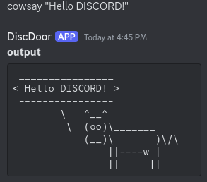

<div align="center">
  <pre style="display: inline-block; border: 1px solid; padding: 10px;">
 ____  _         ____              
|    \|_|___ ___|    \ ___ ___ ___ 
|  |  | |_ -|  _|  |  | . | . |  _|
|____/|_|___|___|____/|___|___|_|  
<br>
An Easy-to-Use Discord-Based Backdoor Tool
 </pre>
</div>

# DiscDoor  

<div style="display: inline;">
    
    
</div>

<br>

DiscDoor is a tool written in [Nim](https://nim-lang.org/), an awesome language. By leveraging a Discord server for communication with the target's computer, it enables seamless command execution **without** the need of port forwarding. This approach simplifies the process of **maintaining control** over a compromised system, allowing users to **send and receive** commands efficiently and securely via Discord.

<div align="center">
    
</div>

>[!WARNING]
>This tool is designed for educational and ethical hacking purposes only. Unauthorized use of this tool on systems or networks without explicit permission is illegal and punishable by law. The developers are not responsible for any misuse or damage caused. Use responsibly and ethically.

- [DiscDoor](#DiscDoor)
    - [What it does](#What-it-does)
        - [See it in action](#See-it-in-action)
    - [Why](#Why)
- [Installation](#Installation)
    - [Bot setup](https://github.com/rdWei/DiscDoor/blob/main/docs/BOTSETUP.md)
    - [Linux](#Linux)
    - [Windows](#Windows)
- [Quick Start](#Quick-Start)
    - [Install backdoor on Linux machine](#Install-backdoor-on-Linux-machine)
    - [Install backdoor on Windows machine](#Install-backdoor-on-Windows-machine)
    - [Setup attacker machine](#Setup-attacker-machine)
- [Contribute](#end-of-file)

---

## What it does

It is a simple tool written in [Nim](https://nim-lang.org/) using the [Dimscord](https://github.com/krisppurg/dimscord) library, DiscDoor allows a connection to be established between two computers using Discord as a communication channel, making it possible to send commands from host A to host B.

### See it in action

https://github.com/rdWei/DiscDoor/assets/107519227/acd4f540-8be9-4ae4-b8db-47040e30d29c

## Why

The idea originated from the need to establish a remote connection to a computer without having to perform port forwarding. With this tool, it is possible to set up a remote connection **WITHOUT** any port forwarding.

## Installation

### Bot Setup

You can find a tutorial on how to setup the bot setup correctly [here](https://github.com/rdWei/DiscDoor/blob/main/docs/BOTSETUP.md).

### Linux

To install the tool on linux simply run the ./buid.sh file, before doing so, however, you must install the dependencies: `nim`, `nimble`, `dimscord`, you can install them automatically with the script below.

```
# Installing Nim
curl https://nim-lang.org/choosenim/init.sh -sSf | sh

# Installing DimScord lib with nimble
nimble install https://github.com/krisppurg/dimscord

# Clone the repo
https://github.com/rdWei/DiscDoor/

# Move into the directory
cd DiscDoor

# Build
chmod +x build.sh && ./build.sh
```

### Windows

To install this tool on windows you need to perform the following steps:

- Download the repo
- Install nim through [this](https://nim-lang.org/install_windows.html) guide.
- Run `nimble install dimscord`
- Move into the project folder
- Run `nim c -o=out/DiscDoor src/main.nim`

>[!NOTE]
>The installation on Windows has not been tested yet. If you find a way to perform the installation more efficiently, please proceed to create a pull request on GitHub or open an issue to discuss the improvements.


## Quick Start

### Install backdoor on Linux machine

To install the backdoor on a Linux machine, simply execute the file located in the out folder on the Linux machine. Afterwards, if the setup has been completed successfully, the bot should send a message on Discord confirming the successful establishment of the connection.
If you want to ensure that the backdoor is launched every time the computer starts up, follow [these](https://www.simplified.guide/linux/automatically-run-program-on-startup) steps. 

### Install backdoor on Windows machine

To install the backdoor on a Windows machine, simply execute the file located in the out folder on the Windows machine. Afterwards, if the setup has been completed successfully, the bot should send a message on Discord confirming the successful establishment of the connection.
If you want to ensure that the backdoor is launched every time the computer starts up, follow [these](https://www.youtube.com/watch?v=KwwDaziEgII) steps.

### Setup attacker machine

On the attacker's side, there is nothing else to do but wait for the bot to confirm that the backdoor has successfully opened. Then, the attacker can start injecting commands and receiving the output.

<br>

<div align="center">


<h6><i>Feel free to contribute and help improve the repo!</i></h6>

</div>

<a name="end-of-file"></a>

[support me](https://github.com/rdWei/rdWei/blob/main/donate.MD)
