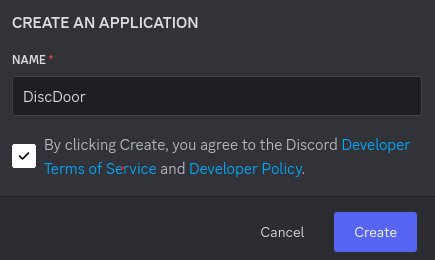
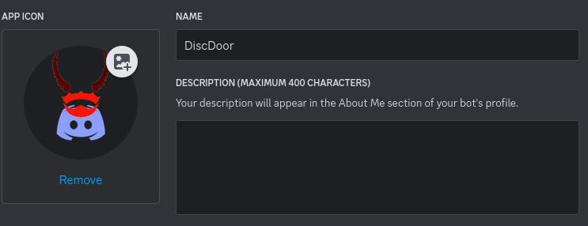
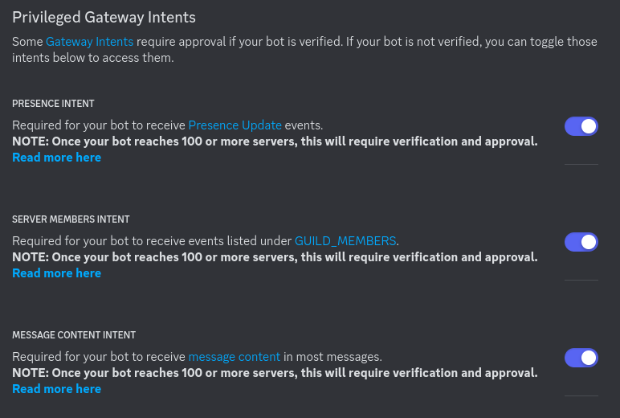
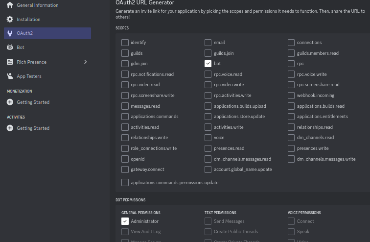
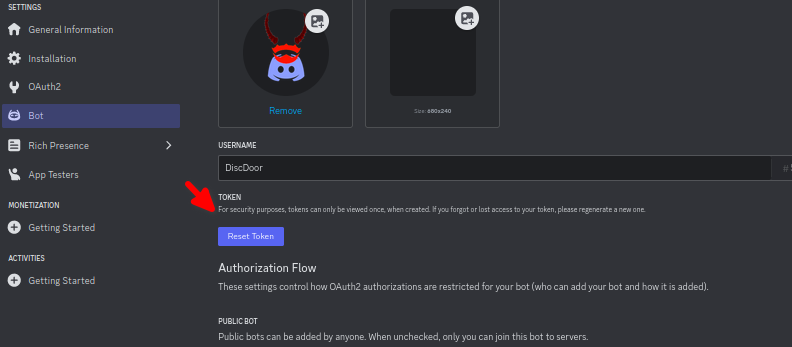
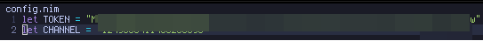
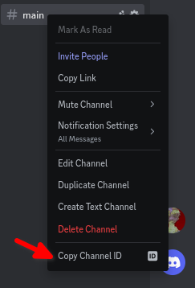
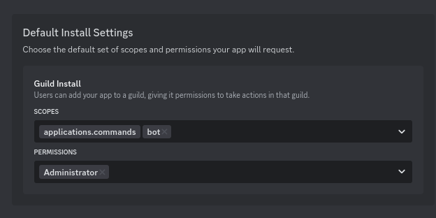
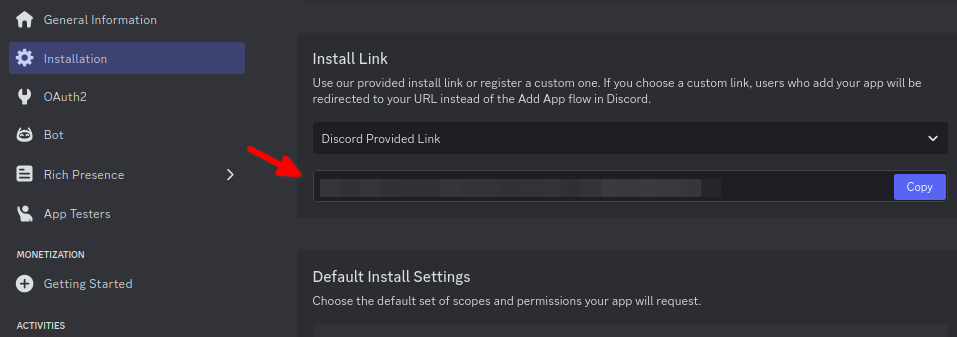
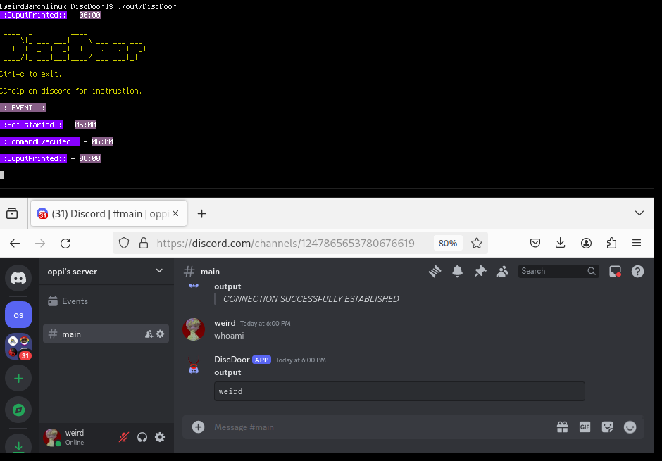

# HOW TO SETUP BOT

1. Go on https://discord.com/developers/docs/quick-start/getting-started
2. Press on `Create App`
3. Inserd DiscDoor in the name field
    - 
4. Change icon with the image `images/logo.png`
    - 
5. Go to the "Bot" section.
6. Turn on all "Privileged Gateway Intents"
    - 
7. Go to the "OAuth2" section.
8. Give "bot" scopes and "Administrator" permission
    - 
9. Go on "bot" section and  press "reset token", then copy it
    - 
10. Put the token inside the `src/config.nim` file
    - 
11. Create discord server
12. Create channel inside the discord server
13. Go inside the discord setting > APP SETTING > Advanced > Turn on developer mode
14. Right click on text channel and then copy ID
    - 
15. Put channel-id inside `src/config.nim` file
    - 
16. Go to Installation section and add permission on scopes and permission
    - 
17. Go on installation and generate link then open the url and add bot to the discord server
    - 
18. Run the program in `out` folder on the target machine
    - 
